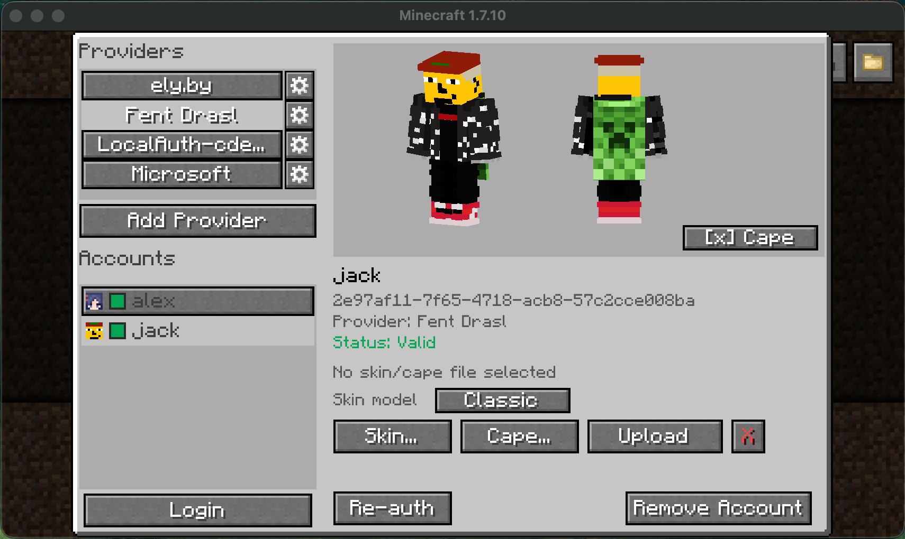

# Wawel Auth


Authentication for Minecraft 1.7.10. Use Microsoft or any Yggdrasil-compatible provider, or run your own auth server alongside the game server. Includes modern and HD skins, animated capes, and optional 3D skin layers.

Highlights:

* log into Microsoft and other Yggdrasil-compatible providers
* manage per-server account selection
* host a local Yggdrasil-compatible auth server on the same port as the Minecraft server
* proxy fallback auth providers such as Microsoft, Ely.by, Drasl, or any other authlib-injector-compatible service
* serve skins, capes, animated capes, and modern / HD skins
* render optional 3D skin layers on the client
* expose an admin web UI for server-side management



[](https://github.com/JackOfNoneTrades/WawelAuth/releases)

[](https://discord.gg/xAWCqGrguG)
<!--[]()
[]()
[]()
[]()-->

## Dependencies

* [UniMixins](https://modrinth.com/mod/unimixins) [](https://www.curseforge.com/minecraft/mc-mods/unimixins) [](https://modrinth.com/mod/unimixins/versions) [](https://github.com/LegacyModdingMC/UniMixins/releases)
* [FentLib](https://github.com/JackOfNoneTrades/FentLib) [](https://github.com/JackOfNoneTrades/FentLib)
* [ModularUI2](https://github.com/GTNewHorizons/ModularUI2) [](https://github.com/GTNewHorizons/ModularUI2) (Client only)
* [Optional] [TabFaces](https://github.com/JackOfNoneTrades/TabFaces) [](https://github.com/JackOfNoneTrades/TabFaces/blob/master/images/badges/forge.png) [](https://modrinth.com/mod/tabfaces) [](https://github.com/JackOfNoneTrades/TabFaces/releases): shows account faces in supported UI elements

## Core features

### Client

* built-in Microsoft OAuth login
* custom Yggdrasil / authlib-injector providers by URL
* per-server account binding in the multiplayer server list
* optional auto-selection when exactly one account matches a server
* skin and cape upload / reset where supported
* 3D skin layers
* modern skin handling for 64x64 and HD skins
* animated cape support

### Server

* a local Yggdrasil-compatible auth server on the same port as Minecraft (HTTP + Minecraft multiplexing on a single port)
* local account registration, invites, and textures
* fallback auth providers for session and profile verification (+ skins/capes)
* an admin web UI at `/admin`
* provider-aware whitelist and op / deop commands

## Client Setup And Use

### Files and locations

* `local.json` is always stored at `config/wawelauth/local.json`
* `local.json` contains `debugMode` and `useOsConfigDir`
* if `useOsConfigDir=true`, client data is looked for in the following locations:
  * Windows: `%APPDATA%/wawelauth/`
  * macOS: `~/Library/Application Support/wawelauth/`
  * Linux: `$XDG_DATA_HOME/wawelauth/` or `~/.local/share/wawelauth/`
* otherwise client data stays in `config/wawelauth/`
* the client uses:
  * `client.json`
  * `skinlayers.json`
  * `accounts.db`

### Adding accounts

* Microsoft is built in.
* Any Yggdrasil / authlib-injector provider can be added by URL.
* `Manage Local Auth...` is the quickest way to use local accounts on a Wawel Auth server.
* Adding the same local server manually as a normal provider is also supported.

### Skins and capes

The client UI can preview, upload, and reset textures when the selected provider supports it.

Skin management buttons can be suppressed per provider through `client.json`, in the case a provider does not provide these functions. This is purely cosmetic.
The following options let you configure this:
* `disableSkinUpload`
* `disableCapeUpload`
* `disableTextureReset`

The `disable*` lists are regexes matched against provider name or API root.

Animated capes are only supported by Wawel Auth servers, and are in the `minecraftcapes[.]net` format.

## Server Setup And Use

### Files and locations

* dedicated servers always use `config/wawelauth/` to store their config, and state data
* that state directory contains the SQLite database, generated keys, and stored textures

---
**NOTE**

* Your private server key is sensitive information, never share it.
* It is important to not change your server keys, if not absolutely necessary. Wawel Auth client users will need to trust the key again, and authlib-injector users will refuse to connect to a server whose public key has changed.

---

### Example local-only setup

```json
{
  "enabled": true,
  "serverName": "My WawelAuth Server",
  "apiRoot": "server-ip:server-port",
  "admin": {
    "enabled": true,
    "token": "strong_password_best_if_randomly_generated"
  }
}
```

Then:

1. set `online-mode=true` in `server.properties`
2. set `apiRoot` to the real public URL clients use (can be IP:PORT, or your domain)
3. set an admin token through `server.admin.token` or `WAWELAUTH_ADMIN_TOKEN`
4. restart the server

### Important server settings

* `registration.policy`: `OPEN`, `INVITE_ONLY`, `CLOSED`
* `textures`: max skin / cape dimensions, file limits, animated cape limits
* `http`: HTTP read timeout and max request body size
* `admin`: web UI enable flag, login token, session TTL

### Admin web UI

If `server.admin.enabled=true`, the admin UI is available at:

* `http://your-host:your-port/admin`

It manages users, textures, invites, whitelist, ops, `server.json`, and `server.properties`.

### Fallback providers

Fallback providers are defined in `server.fallbackServers` and checked in order.

Rules:

* `name` must not contain whitespace
* `name` is used in commands such as `player@provider`

#### Microsoft fallback example

```json
{
  "name": "mojang",
  "sessionServerUrl": "https://sessionserver.mojang.com",
  "accountUrl": "https://authserver.mojang.com",
  "servicesUrl": "https://api.minecraftservices.com",
  "skinDomains": [
    ".minecraft.net",
    ".mojang.com"
  ],
  "cacheTtlSeconds": 300
}
```

#### Ely.by fallback example

```json
{
  "name": "ely.by",
  "sessionServerUrl": "https://authserver.ely.by/api/authlib-injector/sessionserver",
  "accountUrl": "https://authserver.ely.by/api",
  "servicesUrl": "https://authserver.ely.by/api/authlib-injector/minecraftservices",
  "skinDomains": [
    "ely.by",
    ".ely.by"
  ],
  "cacheTtlSeconds": 300
}
```

## Commands

### `/wawelauth`

* `/wawelauth register <username> <password>`
* `/wawelauth invite create [uses|unlimited]`
* `/wawelauth invite list`
* `/wawelauth invite delete <code>`
* `/wawelauth invite purge`
* `/wawelauth test`

### Provider-qualified whitelist and op commands

* `/whitelist add <username>@<provider>`
* `/whitelist remove <username>@<provider>`
* `/op <username>@<provider>`
* `/deop <username>@<provider>`

`<provider>` is either a `fallbackServers[].name` or one of the local aliases: `local`, `localauth`, `wawelauth`, `self`.

Regular whitelist and op commands are disabled.

---
**NOTE**

Plain authlib-injector clients (or vanilla) can authenticate against a Wawel Auth server, but mixed-provider skin handling only works if the client and server run Wawel Auth.

---

## Interoperability Notes


## Building

```bash
./gradlew build
```

## Credits

* Inspired by [last MIT commit](https://github.com/tr7zw/3d-Skin-Layers/commit/1830e6ed7b86550afc2ed2695391a09ca70285e2) of [3D Skin Layers Mod](https://github.com/tr7zw/3d-Skin-Layers)
* [Catalogue-Vintage](https://github.com/RuiXuqi/Catalogue-Vintage) for folder icon and system-open inspiration
* [GT:NH buildscript](https://github.com/GTNewHorizons/ExampleMod1.7.10)
* [Background image](https://www.pinterest.com/pin/367536019569661725/)

## License

`LGPLv3 + SNEED`

## Buy me some creatine

* [ko-fi.com](https://ko-fi.com/jackisasubtlejoke)
* Monero: `893tQ56jWt7czBsqAGPq8J5BDnYVCg2tvKpvwTcMY1LS79iDabopdxoUzNLEZtRTH4ewAcKLJ4DM4V41fvrJGHgeKArxwmJ`

<br>


